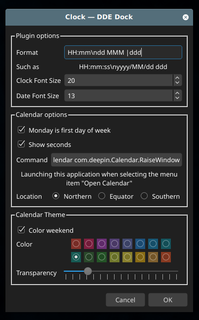

DDE Dock Clock Plugin
=====================

This is a clock plugin with a calendar, lunar phases and zodiac signs for deepin-dock, with customization of the format and theme.




### Installation Guide ###
Compiling using Qt Creator or using the following command:
```
qmake
make
```
Installation: 
```
./install.sh
```

Uninstall:
```
./uninstall.sh
```

### Changes ###
Cleaned changes I don't need 
 - 12-hours mode
 - analog clock
Fixed time font size
Fixed color scheme of calendar widget
Add options to change font/date time size

### Acknowledgment ###
This is forked from https://github.com/v-svg/dde-dock-clock
